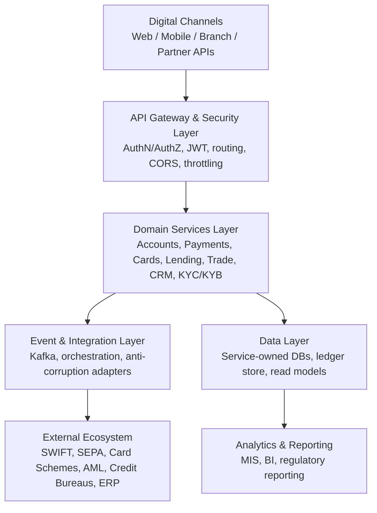
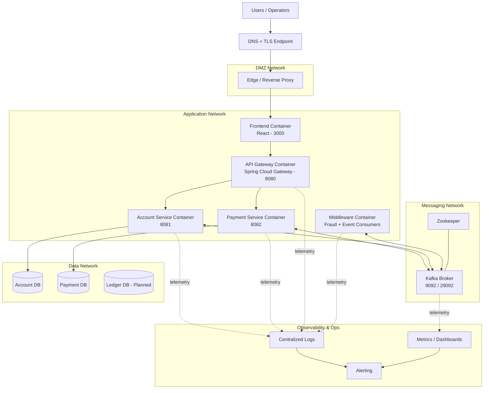
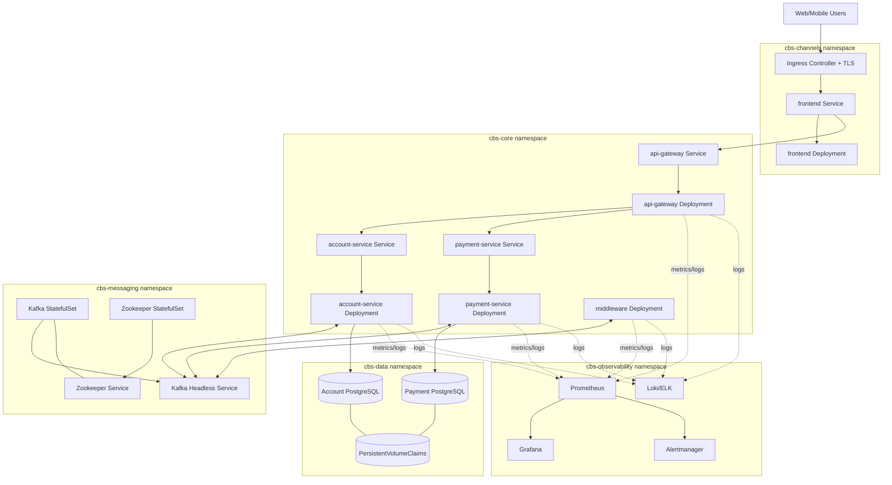

# CBS - Core Banking System

A comprehensive, microservices-based Core Banking System built with Java Spring Boot, featuring:
- **API Gateway** for request routing and authentication
- **Microservices** for Account Management and Payment Processing
- **Event-Driven Middleware** with Apache Kafka for scalable event streaming
- **React Frontend** for modern banking operations UI
- **Docker & Docker Compose** for containerized deployment

## Project Structure

```
cbs_mockup/
├── pom.xml                      # Root Maven POM (parent project)
├── cbs-core/                    # Shared models and DTOs
│   ├── pom.xml
│   └── src/main/java/com/cbs/core/
│       ├── model/               # Account, Payment, Transaction, Customer
│       └── dto/                 # ApiResponse wrappers
├── cbs-api-gateway/             # Spring Cloud Gateway (Port 8080)
│   ├── pom.xml
│   ├── Dockerfile
│   └── src/main/java/com/cbs/gateway/
│       ├── ApiGatewayApplication.java
│       ├── filter/              # JwtAuthenticationFilter
│       └── config/              # GatewayConfig with routing rules
├── cbs-account-service/         # Account Management Service (Port 8081)
│   ├── pom.xml
│   ├── Dockerfile
│   ├── src/main/java/com/cbs/account/
│   │   ├── AccountServiceApplication.java
│   │   ├── entity/              # AccountEntity (JPA)
│   │   ├── repository/          # AccountRepository (Spring Data JPA)
│   │   ├── service/             # AccountService (Business Logic)
│   │   └── controller/          # AccountController (REST endpoints)
│   └── resources/
│       └── application.yml
├── cbs-payment-service/         # Payment Processing Service (Port 8082)
│   ├── pom.xml
│   ├── Dockerfile
│   ├── src/main/java/com/cbs/payment/
│   │   ├── PaymentServiceApplication.java
│   │   ├── entity/              # PaymentEntity (JPA)
│   │   ├── repository/          # PaymentRepository
│   │   ├── service/             # PaymentService with Kafka events
│   │   └── controller/          # PaymentController (REST endpoints)
│   └── resources/
│       └── application.yml
├── cbs-middleware/              # Event streaming & fraud detection
│   ├── pom.xml
│   └── src/main/java/com/cbs/middleware/
│       ├── config/              # KafkaConfig (topics, producers, consumers)
│       ├── listener/            # PaymentEventListener
│       └── service/             # FraudDetectionService
├── cbs-frontend/                # React.js Frontend Application (Port 3000)
│   ├── package.json
│   ├── public/
│   │   └── index.html
│   └── src/
│       ├── App.js               # Main App component
│       ├── App.css
│       ├── index.js
│       └── components/
│           ├── Navigation.js    # Sidebar navigation
│           ├── Dashboard.js     # Overview & balance display
│           ├── AccountManagement.js  # Account operations
│           └── PaymentCenter.js # Payment initiation & tracking
├── docker-compose.yml           # Docker Compose orchestration
└── .gitignore
```

## CBS Reference Architecture (Whole System)

This section defines the full CBS target architecture (current implementation + planned banking domains).

### 1) Layered Architecture



### 2) Logical Component View

```mermaid
flowchart LR
    FE[React Frontend\nPort 3000] --> GW[API Gateway\nPort 8080]

    subgraph DOMAIN[Domain Microservices]
        ACC[Account Service\nPort 8081]
        PAY[Payment Service\nPort 8082]
        KYC[KYC/KYB Service\nPlanned]
        CARD[Card Issuing Service\nPlanned]
        LEND[Lending Service\nPlanned]
        TRADE[Trade Finance Service\nPlanned]
        CRM[CRM Service\nPlanned]
        GL[General Ledger Service\nPlanned]
    end

    GW --> ACC
    GW --> PAY
    GW --> KYC
    GW --> CARD
    GW --> LEND
    GW --> TRADE
    GW --> CRM
    GW --> GL

    subgraph INTEGRATION[Middleware & Event Streaming]
        KAFKA[Kafka Topics\npayment-events, account-events, transaction-events, fraud-events, compliance-events]
        FRAUD[Fraud Detection\n(cbs-middleware)]
    end

    ACC <--> KAFKA
    PAY <--> KAFKA
    KYC <--> KAFKA
    CARD <--> KAFKA
    LEND <--> KAFKA
    TRADE <--> KAFKA
    CRM <--> KAFKA
    GL <--> KAFKA
    KAFKA --> FRAUD

    EXT[External Providers\nSEPA/SWIFT/Card Networks/AML/KYC] <--> INTEGRATION
```

### 3) Domain Boundaries (Target CBS Scope)

1. **Customer & Onboarding Domain**
   - KYC/KYB, customer profile, lifecycle, segmentation
   - Owns customer master data and onboarding decisions

2. **Accounts & Deposits Domain**
   - Account opening/closure, balance management, overdraft, statements
   - Owns account state and posting rules for deposit products

3. **Payments Domain**
   - Initiation, validation, sanctions checks, execution, status tracking
   - Owns payment workflows for SEPA/SWIFT/instant rails

4. **Cards Domain**
   - Card lifecycle (issue, activate, block), limits, authorization integrations
   - Owns card product settings and card-account mapping

5. **Lending Domain**
   - Loan origination, scoring, disbursement, schedules, collections
   - Owns loan contracts and repayment state

6. **Trade Finance Domain**
   - Letters of credit, guarantees, documentary collections
   - Owns trade instrument lifecycle and compliance checkpoints

7. **Ledger & Finance Domain**
   - Double-entry accounting, chart of accounts, period close, reconciliation
   - Owns legal financial books and accounting integrity

8. **Risk, Fraud & Compliance Domain**
   - Fraud scoring, AML monitoring, sanctions, case management
   - Consumes events from all domains for real-time controls

9. **CRM & Engagement Domain**
   - Sales pipeline, service tickets, campaigns, customer interactions
   - Provides 360-degree customer context to channels and operations

10. **Integration & Orchestration Domain**
   - External adapters, canonical event model, process orchestration
   - Shields core domains from external protocol and format volatility

### 4) Interaction Pattern

1. **Synchronous path (command/query)**
   - Channel -> API Gateway -> Domain service REST API
   - Used for user-facing reads/writes requiring immediate response

2. **Asynchronous path (events)**
   - Domain service emits event -> Kafka topic -> subscribers process independently
   - Used for decoupled downstream processing (fraud, compliance, CRM, reporting)

3. **Consistency strategy**
   - Strong consistency inside each service boundary
   - Eventual consistency across services via idempotent consumers and retries

### 5) Deployment Topology (Current Repo)

1. **Frontend**: React application (`cbs-frontend`) on port `3000`
2. **Gateway**: Spring Cloud Gateway (`cbs-api-gateway`) on port `8080`
3. **Domain services**:
   - Account Service (`cbs-account-service`) on port `8081`
   - Payment Service (`cbs-payment-service`) on port `8082`
4. **Middleware**: Kafka + Zookeeper + `cbs-middleware`
5. **Shared contracts**: `cbs-core` for common DTO/model artifacts

### 6) Architecture Principles

1. **Domain-driven decomposition** with service-owned data
2. **API-first contracts** for channel and partner integrations
3. **Event-driven extensibility** for risk/compliance/reporting workloads
4. **Security by design**: centralized gateway policies and token validation
5. **Operability**: containerized services, health checks, observable event flows

### 7) Dedicated Infrastructure View



**Runtime placement in this repository:**
1. `docker-compose.yml` orchestrates frontend, gateway, domain services, Kafka, and Zookeeper.
2. Each backend service runs as an independently deployable container with its own runtime config.
3. Datastores are service-owned (separate schemas/instances per domain recommended for production).

**Infrastructure concerns by layer:**
1. **Edge**: TLS termination, WAF/rate-limit, request size limits.
2. **Application**: horizontal scaling for stateless gateway/services.
3. **Messaging**: topic partitioning, retention, dead-letter strategy, idempotent producers.
4. **Data**: backups, PITR, encryption at rest, migration/version strategy.
5. **Operations**: health probes, SLO metrics, alert routing, incident runbooks.

### 8) Kubernetes Infrastructure View



**Kubernetes platform controls:**
1. **Traffic**: Ingress + cert-manager for TLS certificates and host routing.
2. **Scaling**: HPA for stateless deployments (gateway/services) based on CPU and request latency.
3. **Resilience**: readiness/liveness probes, PodDisruptionBudget, and rolling updates.
4. **Stateful workloads**: StatefulSets for Kafka/Zookeeper and PVC-backed databases.
5. **Security**: namespace isolation, NetworkPolicies, Secrets, and least-privilege ServiceAccounts.
6. **Release strategy**: Helm or Kustomize with separate values/overlays per environment.

## Database Schema

### Accounts Table
```sql
CREATE TABLE accounts (
    account_id VARCHAR(36) PRIMARY KEY,
    customer_id VARCHAR(36) NOT NULL,
    account_type VARCHAR(50),
    currency VARCHAR(3),
    balance DECIMAL(19, 2),
    available_balance DECIMAL(19, 2),
    status VARCHAR(20),
    iban VARCHAR(34) UNIQUE,
    bic VARCHAR(11),
    created_at TIMESTAMP,
    last_modified TIMESTAMP,
    interest_rate DECIMAL(5, 4),
    product_code VARCHAR(50)
);
```

### Payments Table
```sql
CREATE TABLE payments (
    payment_id VARCHAR(36) PRIMARY KEY,
    initiator_account_id VARCHAR(36),
    beneficiary_iban VARCHAR(34),
    beneficiary_name VARCHAR(255),
    amount DECIMAL(19, 2),
    currency VARCHAR(3),
    payment_type VARCHAR(50),
    payment_status VARCHAR(50),
    created_at TIMESTAMP,
    executed_at TIMESTAMP,
    requested_execution_date DATE,
    remittance_information VARCHAR(500),
    purpose_code VARCHAR(10),
    end_to_end_reference VARCHAR(50),
    mandate_reference VARCHAR(50),
    transaction_id VARCHAR(36),
    error_message VARCHAR(500),
    beneficiary_bank_code VARCHAR(50),
    exchange_rate DECIMAL(10, 4),
    channel VARCHAR(50)
);
```

## Installation & Setup

### Prerequisites
- Java 17+
- Maven 3.8+
- Node.js 18+ and npm
- Docker & Docker Compose
- Git

### Option 1: Local Development (Without Docker)

1. **Clone the repository**
   ```bash
   git clone https://github.com/lukasokal/cbs_mockup.git
   cd cbs_mockup
   ```

2. **Build the backend services**
   ```bash
   mvn clean install -DskipTests
   ```

3. **Start Kafka & Zookeeper** (requires Docker)
   ```bash
   docker-compose up zookeeper kafka -d
   ```

4. **Start microservices** (in separate terminals)
   ```bash
   # Terminal 1: API Gateway
   cd cbs-api-gateway
   mvn spring-boot:run
   
   # Terminal 2: Account Service
   cd cbs-account-service
   mvn spring-boot:run
   
   # Terminal 3: Payment Service
   cd cbs-payment-service
   mvn spring-boot:run
   ```

5. **Start the React frontend** (in a new terminal)
   ```bash
   cd cbs-frontend
   npm install
   npm start
   ```

6. **Access the application**
   - Frontend: http://localhost:3000
   - API Gateway: http://localhost:8080
   - Account Service: http://localhost:8081
   - Payment Service: http://localhost:8082

### Option 2: Docker Compose (Recommended)

1. **Clone and navigate to project**
   ```bash
   git clone https://github.com/lukasokal/cbs_mockup.git
   cd cbs_mockup
   ```

2. **Build all services**
   ```bash
   mvn clean package -DskipTests
   ```

3. **Start all containers**
   ```bash
   docker-compose up --build
   ```

4. **Access the application**
   - Frontend: http://localhost:3000
   - API Gateway: http://localhost:8080
   - Kafka: localhost:9092

5. **Stop all services**
   ```bash
   docker-compose down
   ```

## API Endpoints

### Account Management Service

**Create Account**
```http
POST /api/accounts
Content-Type: application/json

{
  "customerId": "CUST001",
  "accountType": "CURRENT",
  "currency": "EUR",
  "balance": 1000.00,
  "iban": "SK9212345678901234567890"
}
```

**Get Account**
```http
GET /api/accounts/{accountId}
```

**Get Customer Accounts**
```http
GET /api/accounts/customer/{customerId}
```

**Update Account**
```http
PUT /api/accounts/{accountId}
Content-Type: application/json

{
  "status": "ACTIVE",
  "balance": 2000.00
}
```

**Debit Account**
```http
POST /api/accounts/{accountId}/debit?amount=100.00
```

**Credit Account**
```http
POST /api/accounts/{accountId}/credit?amount=100.00
```

### Payment Processing Service

**Initiate Payment**
```http
POST /api/payments
Content-Type: application/json

{
  "initiatorAccountId": "ACC001",
  "beneficiaryIban": "DE89370400440532013000",
  "beneficiaryName": "John Doe",
  "amount": 500.00,
  "currency": "EUR",
  "paymentType": "SEPA_SCT",
  "remittanceInformation": "Invoice #123"
}
```

**Get Payment**
```http
GET /api/payments/{paymentId}
```

**Get Payments by Account**
```http
GET /api/payments/account/{accountId}
```

**Get Payments by Status**
```http
GET /api/payments/status/{status}
```

**Submit Payment**
```http
POST /api/payments/{paymentId}/submit
```

**Approve Payment**
```http
POST /api/payments/{paymentId}/approve
```

**Reject Payment**
```http
POST /api/payments/{paymentId}/reject?reason=Insufficient%20funds
```

## Event-Driven Architecture (Kafka)

### Topic: `payment-events`
Events:
- `payment-initiated` - Payment created
- `payment-submitted` - Payment submitted for processing
- `payment-accepted` - Payment approved and processed
- `payment-rejected` - Payment rejected with reason

### Topic: `fraud-events`
- Real-time fraud alerts with risk scores

### Topic: `compliance-events`
- AML/CFT compliance checks and alerts

## Technology Stack

**Backend:**
- Spring Boot 3.2
- Spring Cloud Gateway
- Spring Data JPA
- Spring Kafka
- H2 Database
- PostgreSQL (production)
- Lombok
- JWT

**Frontend:**
- React 18
- Axios
- React Router

**Middleware & Infrastructure:**
- Apache Kafka 7.5
- Zookeeper 7.5
- Docker
- Docker Compose

## Configuration Files

### Spring Profiles
- `default` - Local development with H2
- `docker` - Docker Compose environment with Kafka

### Environment Variables
```bash
SPRING_KAFKA_BOOTSTRAP_SERVERS=localhost:9092 (or kafka:29092 in Docker)
SPRING_DATASOURCE_URL=jdbc:h2:mem:accountdb
JWT_SECRET=cbs-secret-key-banking-system-2026
```

## Deployment

### Production Checklist
1. [ ] Use PostgreSQL instead of H2
2. [ ] Enable SSL/TLS for API Gateway
3. [ ] Implement proper JWT token generation and validation
4. [ ] Set up external Kafka cluster with replication
5. [ ] Add database backups and recovery procedures
6. [ ] Implement comprehensive logging and monitoring
7. [ ] Add health checks and circuit breakers
8. [ ] Set up CI/CD pipeline
9. [ ] Implement rate limiting and throttling
10. [ ] Add comprehensive error handling

## Next Steps & Enhancements

1. **Additional Microservices**
   - Customer Service (KYC/KYB)
   - Card Issuing Service
   - Lending Service
   - Compliance Service

2. **Advanced Features**
   - Multi-factor authentication
   - Real-time fraud detection with ML
   - Advanced reporting and analytics
   - Mobile banking app (iOS/Android)
   - Open Banking / PSD2 API compliance

3. **DevOps & Infrastructure**
   - Kubernetes deployment
   - Service mesh (Istio)
   - Distributed tracing (Jaeger)
   - Metrics collection (Prometheus/Grafana)

## Documentation

- [System Requirements](./docs/REQUIREMENTS.md)
- [Development Guide](./docs/DEVELOPMENT.md)
- [API Documentation](./docs/API.md)
- [Database Schema](./docs/DATABASE.md)

## Contributing

This is a mockup/prototype system for learning and demonstration purposes. Feel free to fork, modify, and extend.

## License

MIT License - See LICENSE file for details

## Contact & Support

For questions or issues, please create an issue on GitHub or contact the development team.

---

**Note:** This is a demonstration/mockup system showcasing Core Banking System architecture using modern Java and microservices patterns. For production use, additional security, compliance, and reliability measures must be implemented.